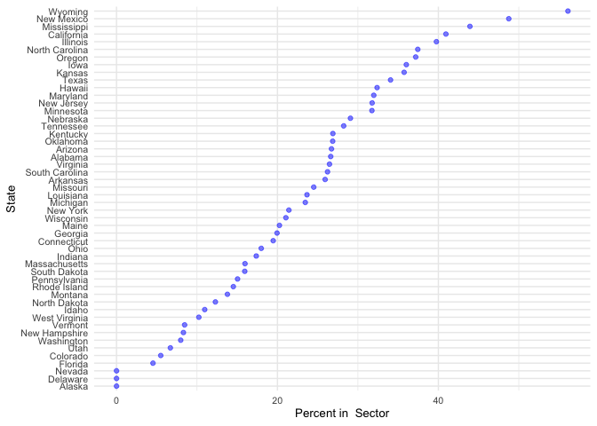
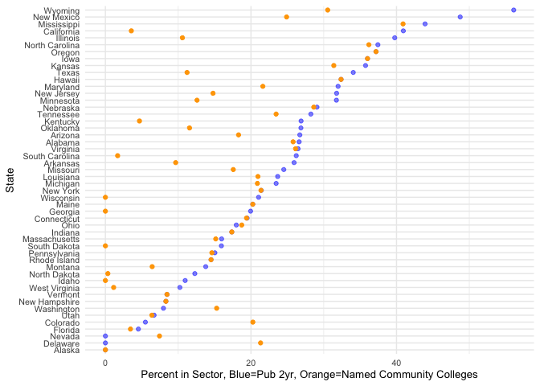

What’s a Community College (Seriously)?
================
Will Doyle
4/12/2021

In an insightful [New America
piece](https://www.newamerica.org/education-policy/edcentral/a-different-approach-to-free-community-college/),
Kevin Carey points out that a free community college plan depends
crucially on the definition of community college. Carey is right to
point out is that we don’t have a single definition of a community
college. Many states don’t have any colleges called “community
colleges”, and some states don’t have any institutions that fulfill the
classic missions of community colleges.

Carey’s piece includes a good breakdown of the ratio of associate’s
degrees to bachelor’s degrees awarded by state. I was curious what
percent and number of students in each state might be counted as
“community college” students using different possible definitions of
“community college.”

## IPEDS definitions

Colleges and universities report data about themselves to the federal
government through the Integrated Postsecondary Education Data System
(IPEDS). IPEDS classifies institutions that award even 1 bachelor’s
degree per year as 4-year institutions. This misses a large number of
institutions that either are community colleges or fulfill the roles of
community colleges in their state. Here’s the percent of students\* in
each state that attend “community colleges” if the definition is public
two year institutions that don’t award any bachelor’s degrees:

## Percent of Students Enrolled in Public Two-Year Colleges, by State: 2019

<!-- -->

Source: IPEDS, 2019

This matches up with this
[table](https://nces.ed.gov/programs/digest/d19/tables/dt19_304.80.asp)
published by NCES in 2020. There are some surprises here: Florida, a
national leader in the development of community colleges, is reported as
having about three percent of its enrollment in public two year
colleges. Delaware and Alaska do not have any students enrolled in
institutions that the federal government classified as public two-year
institutions.

## Carnegie Classification– Instructional Program: Associates Institutions

The [Carnegie
Classification](https://carnegieclassifications.iu.edu/classification_descriptions/ugrad_program.php)
includes a definition of instructional programs that doesn’t have a
“community college” definition but does include “Associates
Institutions” of different types. The graph below shows the percent of
students enrolled in all types of Associates institutions compared with
the percent enrolled in public two-year colleges as defined by NCES.

<!-- -->

Source: IPEDS, 2019

Using the Carnegie definition there are considerably higher enrollments
in Associates institutions as opposed to public two-year institutions.
The biggest gains would come in the biggest states: Florida adds 280,000
students and California adds 144,000 students, but much smaller
Washington adds 120,000 students. Overall, using the Carnegie Associates
definition to designate an institution a “community college” adds
916,000 students as opposed to using public two-year college.

## Institutions with Community College in the Name

The simplest way to define an institution as a community college may be
to use its name. The graph below compares enrollment in public two-year
institutions with enrollment in institutions that include “community
college” in their name.
<!-- -->

Source: IPEDS, 2019

Most states have considerably more public two-year colleges than they
have institutions with the term “Community College’ in their name. For
instance, California has about 40 percent of full time equivalent
students in public two years, but only about 10 percent of them attend
institutions that call themselves”community colleges." Wisconsin,
Georgia, Idaho all go to 0 because they don’t have any institutions
named “community” colleges. Limiting eligibility to institutions that
have the name “community college” would mean 3.5 million fewer students
with eligibility.

## Proportion of Degrees

What if we used the proportion of degrees awarded? Sometimes the
proportion of degrees that are associates is used, but I took another
tack and instead defined it as institutions where less than half of all
degrees awarded in a single year are bachelor’s degrees.

<!-- -->

Source: IPEDS, 2019

The biggest change here is in the very small (population-wise) state of
Alaska, where most campuses mostly award degrees other than Bachelor’s
degrees. This definition would result in 3.5 million *more* students
being in “community colleges” than if the public two-year definition
were used.

Which is the right definition? I don’t know! It does seem to me that
focusing on the first two years of public higher education, without
reference to type of institution is a better way to go. The main point
is that states are VERY different in the way that they structure their
systems of higher education, and there are big implications for students
for any arbitrary definition of “community college” that we come up
with.

-   I define students as Full Time Equivalent (FTE) students, which
    basically means taking the total number of credit hours and dividing
    by 12. Headcount enrollment–the actual number of people attending–
    is really important, but state-to-state comparisons aren’t ideal
    using headcount because of variation in state policies supporting
    part-time students. The data is from [IPEDS,
    2019](https://nces.ed.gov/ipeds/use-the-data). Code available:
    (<https://github.com/wdoyle42/ccwhat>).
